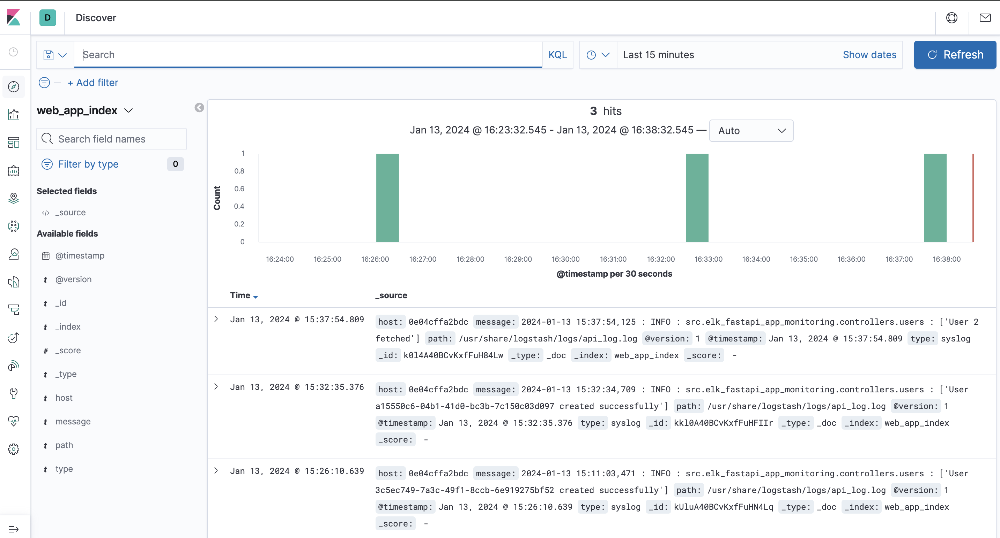

# ELK Stack and FastAPI App Documentation

## Table of Contents
1. [Introduction](#introduction)
2. [Getting Started](#getting-started)
   - [Prerequisites](#prerequisites)
   - [Installation](#installation)
3. [ELK Stack Configuration](#elk-stack-configuration)
   - [Elasticsearch](#elasticsearch)
   - [Logstash](#logstash)
   - [Kibana](#kibana)
4. [FastAPI App](#fastapi-app)
   - [API Implementation](#api-implementation)
   - [Docker Configuration](#docker-configuration)
5. [Docker Compose](#docker-compose)
6. [Usage](#usage)
   - [Running the App and ELK Stack](#running-elk-stack) 

## Introduction
This repository contains the configuration files and setup for an ELK (Elasticsearch, Logstash, Kibana) stack along with a FastAPI app that implements CRUD methods.

## Getting Started

### Prerequisites
Before starting, ensure you have the following installed:
- Docker
- Docker Compose

### Installation
1. Clone the repository:
    ```bash
    git clone https://github.com/olahsymbo/elk-fastapi-app-monitoring.git
    cd elk-fastapi-app-monitoring
    ```

2. Install the required Python packages using Poetry:
    ```bash
    poetry install
    ```

## ELK Stack Configuration

### Elasticsearch
- Configuration file: `elasticsearch/elasticsearch.yml`

### Logstash
- Configuration files:
  - `logstash/config/logstash.yml`
  - `logstash/pipeline/logstash.conf`

### Kibana
- Configuration file: `kibana/kibana.yml`

## FastAPI App

### API Implementation
The FastAPI app is implemented in `apis/app.py` and includes a POST | GET | PUT | DELETE request methods.

### Docker Configuration
Dockerfile for FastAPI app: `Dockerfile`

## Docker Compose

Docker Compose file: `docker-compose.yml`

## Usage

### Running the App and ELK Stack
1. Navigate to the project root directory.
2. Run the following command:
   ```bash
   docker-compose up -d
   ```

### ELK Output

Here is kibana dashboard showing the logs:

